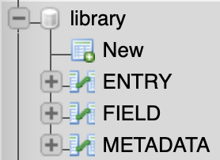

# ppf.jabref


ppf.jabref provides a [python](https://www.python.org) interface to
[JabRef](https://www.jabref.org) SQL databases. It maps database relations
to python classes using [SQLAlchemy](https://www.sqlalchemy.org).
Also, ppf.jabref provides tools to parse the data stored inside the 
database tables.

## JabRef's Database Layout

A JabRef database has these tables:



* ENTRY holds an ID, the entry type (e.g. 'book', or 'article'), and
  a version number
* FIELD uses the same entry as a foreign key, and lists all the fields
  in the entries row by row as key-value pairs.
* METADATA holds data about your library such as the base path of your 
  document folder and the definitions of your filter groups.

The "file" field is a text describing which files are linked the the present
entry. Note that all linked files are listed in a _single_ row in the DB.
The links are separated by ';' inside the text. Also, each link has multiple
properties: name, path, and filetype. In the following example,
entry_shared_id 2 has a single link with name='', path='a.pdf',
filetype='PDF'.

<p align="middle">


</p>

## Using ppf.jabref

ppf.jabref relies on SQLAlchemy for database access. All that ppf.jabref
adds to this is a data model which makes sqlalchemy understand how a 
JabRef database is structured (by providing classes Entry and Field).

A simple example that queries all entries and prints a selection of
the fields looks like this:

```python
from sqlalchemy import create_engine
from sqlalchemy.orm import sessionmaker
from ppf.jabref import Entry, File

engine = create_engine('<your connection string here>', echo=False)
Session = sessionmaker(bind=engine)
session = Session()

q = session.query(Entry)
for entry in q:
    print(entry.fields['author'], '\t',
        entry.fields['title'], '\t',
        entry.fields['year'], '\t', end='')

    files = File.from_string(entry.fields['file'])
    for i in range(len(files)):
        f = files[i]
        print(f.path, '\t', end='')
```

The first 6 lines are setup code to import required packages and to set up
the database connection. The query then uses ppf.jabref's Entry class to
obtain all Entries (=references) in the JabRef database. The for-loop
shows how to access fields and uses the File class to find out where the
documents linked to this entry are stored.
